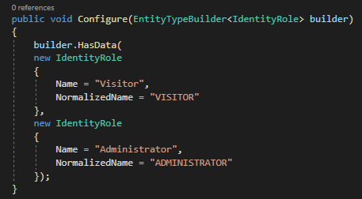

# .NET_Projekt
Projekt z przedmiotu platf. program. .NET i Java, z zakresu .NET. 

## Spis Treści
* [Wprowadzenie](#wprowadzenie)
* [Podział zadań](#podział-zadań)
* [Technologie](#technologie)
* [Dokumnetacja projetktu](#dokumentacja-projektu)

### Wprowadzenie: 
- Wybrana technologia:  
Aplikacja webowa - ASP.NET Core
- Wybrana tematyka:  
Tematem pracy jest aplikacja pozwalająca na wyszukiwanie żartów na podstawie dowolnego słowa. Bazą żartów jest strona https://icanhazdadjoke.com/. Aplikacja pozwala użytkownikowi na rejestację oraz logowanie. W tym celu wykorzystuje bazę danych (komunikacja za pomocą Entity Framework). Po poprawnym zalogowaniu (tzn. zweryfikowaniu poprawności danych z tymi znajdującymi się w bazie) użytkownik może wpisać interesujący go tag, a przefiltrowane żarty zostają wyświetlane na stronie. Dodatkowo, na stronie głównej wyszukiwarki żartów generuje się losowy żart.

### Podział zadań: 
- Jagoda Kubacka (242055):  
stworzenie rejestracji użytkowników oraz logowania. Sprawdzanie poprawności danych z loginu z tymi z rejestracji. Stworzenie pól wymaganych. Dodanie dziennika obsługi zdarzeń.
- Aleksandra Stawarz (241535):  
znalezienie oraz podłączenie API do projektu. Generowanie losowego żartu oraz przeszukiwanie żartów ze względu na przekazane słowo. Dodanie LINQ.
- Agata Mazur (241518):  
realizacja konta użytkownika. Dodanie opcji "dodaj do ulubionych" oraz przekazywanie tego do widoku danego konta. Poprawa wizualnego wyglądu strony.

### Technologie: 
* Komunikacja z bazą danych (Entity Framework)
* LINQ (zadawanie pytań na kolekcjach obiektów o składni podobnej do SQL)
* Komunikacja z zewnętrznym API (wykorzystanie formatu JSON)
* Obsługa wielowątkowości (asynchroniczność)
* Log (obsługa dziennika zdarzeń)
* User Interface (komunikacja z użytkownikiem)
* Wykorzystanie zewnętrznych bibliotek (korzystając z pakietu NuGet)

### Dokumentacja projektu:
### Realizacja projektu - login oraz rejestracja: 
1. Rejestracja użytkownika:  
  
Rejestracja wymaga pdoania takich danych jak: 
- pierwsze imię
- nazwisko
- e-mail
- hasło  
Email oraz hasło są wymagane oraz sprawdzane. Email musi mieć odpowiednią formę, tzn. posiadać "@". Hasło musi mieć odpowiednią trudność, m.in. liczby, duża i mała litera, odpowiednia długość. Hasła podane w rejestracji są porównywane, by mieć pewność, że jest ono odpowiednio wpisane. 

  
Do rejestracji użyta jest biblioteka AutoMapper. UserMenager pogodzi od Identity i zapewniametody pomocnicze, by pomóc zarządzać danymi użytkownika.  
 
Mapujemy adres e-mail na nazwę użytkownika. Wynika to z formularza rejestracyjnego.

2. Login użytkownika:  
 
Login wymaga podania takich danych, jak:
- e-mail
- hasło  
Email oraz hasło są obowiązkowe. W email sprawdzany jest odpowiedni wpisywany format. Poza tym login posiada taką funkcję jak "remember me", czyli możliwość zapamiętania email'a oraz hasła w przypadku ponownego logowania.  
Gdy użytkownik użyje funkcji Zarejestruj metody UserMenager oraz SignInMenager są wstrzykiwane do kontrolera. Rejestracja tworzy użytkownika poprzez funkcję CreareAscync obiektu UserMenager.  
Sprawdzamy,  czy  model  jest  prawidłowy.  Jeżeli  tak,  to  używamy  metodyFindByEmailAsynczUserMenagerby zwrócić użytkownika przez email. Jeżeli użytkownik istnieje i hasło pasuje, totworzymy obiektClaimsIdentityz żądaniem o nazwę użytkownika oraz ID. Następnie jest logowaniepoprzez funkcjęSignInAsync.MetodaPasswordSignInAsyncto metoda, która ma cztery parametry- nazwa użytkownika, hasło, ciasteczka i LockOut(awaria). Działaniem Succeeded sprawdzamy, czyzakończyło się powodzeniem nasze działanie.Poprzez  zastosowanie  roli  należało  również  zastosować  pewne  zabezpieczenie.  Jeżeli  użytkownik,który nie ma uprawnień będzie chciał uzyskać dostęp do nieuprawnionych akcji zostanie przekiero-wany na stronę logowania. Sprawdzamy, czy returnUrl to lokalny adres Url. Jeśli tak, to przekieru-jemy na ten adres. Jeśli nie, przekieruje na stronę główną.  
 
 
Korzystamy również z klasySignInManager. Zapewnia interfejs API logowania za pomocą wielumetod pomocniczych.  
 

3. Użytkownik:  
 
Wykorzystane jest tutaj ASP.NET Core Identity. Umożliwia to dodania funkcji logowania doaplikacji. Użytkownicy mogą tworzyć konto i zalogować się przy pomocy nazwy użytkownika (zmapowanej  z  email)  oraz  hasła.  W  tym  przypadku  ASP.NET  Core  Identity  jest  skonfigurowane  dokorzystania  z  bazy  danych  Entity  Framework.  Przechowuje  to  nazwę  użytkowników,  hasła.  Jeśliużytkownik został pomyślnie utworzony, jest zalogowany za pomocą metodySignInAsync, zawartejrównież w rejestracji. Po zalogowaniu metodaSignInAsyncprzechowuje pliki cookie.Dzięki klasie User rozszerzamy IdentityUser o dwie dodatkowe funkcje. Będą one dodane do bazydanych. Nie trzeba ich dodawać, jeśli klasa IdentityUser<TKey> jest wystarczająca  
4. Baza danych:  
 
Klasa dziedziczy po IdentityDbContext, dlatego, że musi być ona połączona z tożsamością (Iden-tity). Dodatkowo podłączona jest tutaj funkcjaRoleConfiguration. W naszym programie są dwierole - użytkownik oraz administator.  
 
  
5. Wylogowanie:  
 
Po uruchomieniu logujemy się pomyślnie. Następnie klikamy, by się wylogować, a plik cookiezostanie usunięty.

### Realizacja projektu - API:
1. Konfiguracja: 
Inicjalizacja klienta oraz przypisanie adresu bazowego odbywa się w pliku Startup.cs  
 
Utworzenie klienta odbywa się w kontrolerze (ApiController.cs). 

2. Stworzenie funkcji wyszukujących żarty:  
Zgodnie z założeniami projektowymi napisano funkcję, która ma za zadanie przeszukać żarty i wybrać takie, które zawierają w sobie podane przez użytkownika słowo klucz - SearchJoke(). W celu pobrania słowa ze strony skorzystano z formularza (form). Bazowy adres zmodyfikowano tak, aby zawierał w sobie możliwość wyszukiwania (słowo search) oraz znalezione słowo. Odnalezione żarty są deserializowane; w formie stringa dodawane są do listy. Dodatkowo są one sortowane względem długości - spełnione zostało założenie użycia LINQ. 
  
Dodano również wyszukiwanie losowego żartu - GetJoke(), który umieszczono na stronie głównej wyszukiwarki. Funkcja ta zwraca obiekt typu JokeModel, z którego w widoku wyciągany jest string. 
 
Obie fukncje działają asynchronicznie. 

3. Zwracanie widoku:  
W obu przypadkach użyto operatora await. W przypadku widoku strony startowej do widoku przekazywany jest model przypisany do funkcji GetJoke().  
 
Jeśli chodzi o wyświetlanie wyszukanych żartów posłużono się Viewbag, a racji tego, że funkcja zwraca listę stringów. Dodano również zliczanie ilości wyszukanych żartów oraz informujące o tym użytkownika komunikaty. 
 

